# MP3-Toolings

## Brief

A set of functions designed to:
1. Download mp3 files from Youtube.
2. Format their name.
3. Set their metadata.
4. Sort them.

### [Documentation](https://github.com/NRV2ouf/mp3-toolings/wiki)

## Workflow example

```mermaid
flowchart TD
  Empty --> |download_mp3| Downloaded
  Downloaded --> |remove_brackets_from_filenames| Pairless
  Pairless --> |remove_duplicate_artist_names| DuplicateLess
  DuplicateLess --> |trim_spaces_from_filenames| SpaceTrimmed
  SpaceTrimmed --> |move_files_to_artist_folder| Sorted

classDef leftAlign text-align:left, font-family:monospace;

Empty["<pre>
📁 Music/
</pre>"]:::leftAlign

Downloaded["<pre>
📁 Music/$TMPDIR/
├── channel1 - artist1 - song1.mp3
├── channel1 - artist1 - song2 (demo).mp3
├── channel2 - artist2 - song3 [live] (lyrics).mp3
├── channel3 - artist3 - song4 [live] - lyrics.mp3
└── channel4 - song5 (lyrics).mp3
</pre>"]:::leftAlign

Pairless["<pre>
📁 Music/$TMPDIR/
├── channel1 - artist1 - song1.mp3
├── channel1 - artist1 - song2 .mp3
├── channel2 - artist2 - song3  .mp3
├── channel3 - artist3 - song4  - lyrics.mp3
└── channel4 - song5 .mp3
</pre>"]:::leftAlign

DuplicateLess["<pre>
📁 Music/$TMPDIR/
├── channel1 - song1.mp3
├── channel1 - song2 .mp3
├── channel2 - song3  .mp3
├── channel3 - artist3 - song4  - lyrics.mp3
└── channel4 - song5 .mp3
</pre>"]:::leftAlign

SpaceTrimmed["<pre>
📁 Music/$TMPDIR/
├── channel1 - song1.mp3
├── channel1 - song2.mp3
├── channel2 - song3.mp3
├── channel3 - artist3 - song4 - lyrics.mp3
└── channel4 - song5.mp3
</pre>"]:::leftAlign

Sorted["<pre>
📁 Music/$TMPDIR/
├── channel1/
│   ├── channel1 - song1.mp3
│   └── channel1 - song2.mp3
├── channel2/
│   └── channel2 - song3.mp3
├── channel4/
│   └── channel4 - song5.mp3
└── channel3 - artist3 - song4 - lyrics.mp3
</pre>"]:::leftAlign
```



## Requirements

- bash ≥ 4.0
- [yt-dlp](https://github.com/yt-dlp/yt-dlp) to download videos from Youtube
    - ```
      sudo curl -L https://github.com/yt-dlp/yt-dlp/releases/latest/download/yt-dlp \
        -o /usr/local/bin/yt-dlp && \
        sudo chmod a+rx /usr/local/bin/yt-dlp
      ```
- [id3v2](https://github.com/myers/id3v2) to set metadata of mp3 files
    - `sudo apt install id3v2`

## Development tools

- [bats](https://github.com/bats-core/bats-core) for running tests.
    - `sudo apt install bats`
- [shellcheck](https://github.com/koalaman/shellcheck) for linting scripts
    - `sudo apt install shellcheck`
- [shdoc](https://github.com/reconquest/shdoc) for generating documentation
    - ```
      curl -L https://raw.githubusercontent.com/reconquest/shdoc/master/shdoc \
        -o /usr/local/bin/shdoc && \
        chmod +x /usr/local/bin/shdoc
      ```
